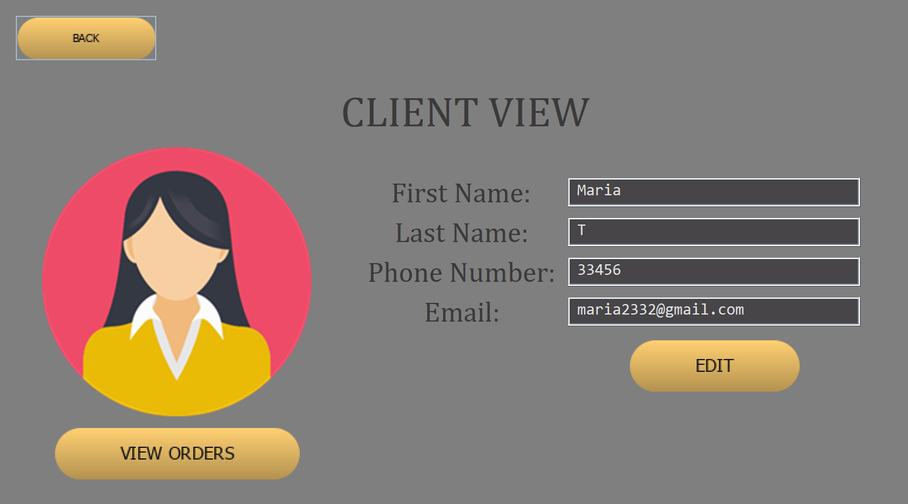
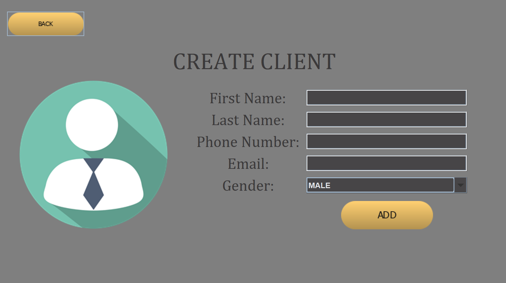
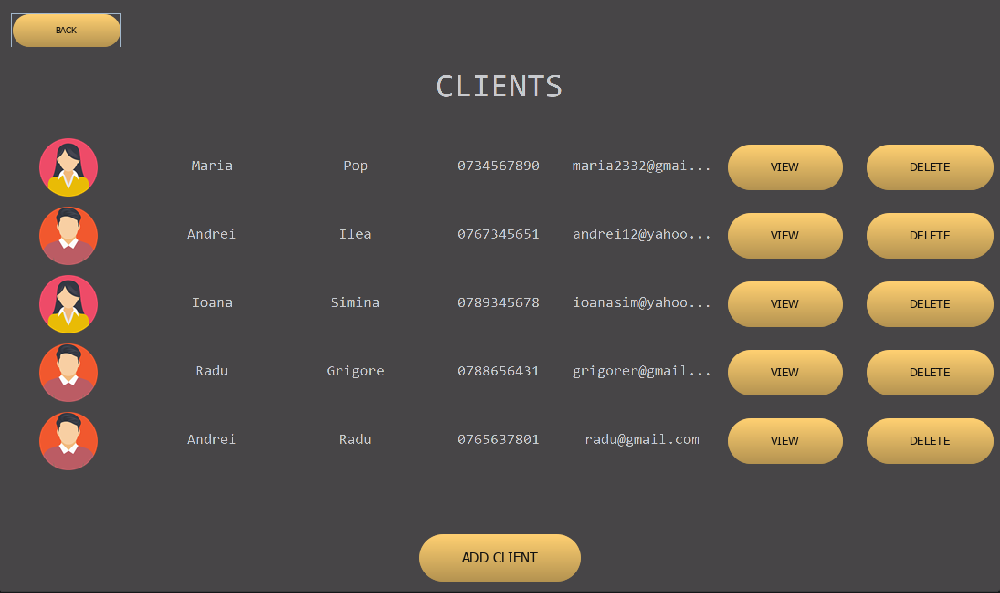
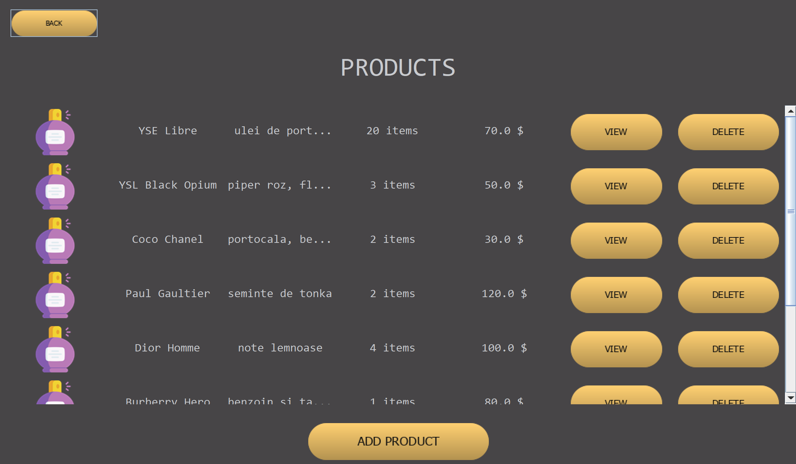

# 📦 Warehouse Order Management System

📍 Technical University of Cluj-Napoca, Faculty of Automation and Computer Science  
👩‍💻 Student: Maria-Magdalena Creț  

---

## 📝 Description

This application is a **Java-based desktop app** designed to manage customer orders in a warehouse. It follows a **Layered Architecture** and uses a **relational database** for storing and processing data related to products, customers, and orders.

---

## 🎯 Objectives

- Implement a **layered architecture** with packages:
  - `model` – Data models
  - `dao` – Data Access Layer (DAO)
  - `business` – Business Logic
  - `gui` – Swing-based User Interface
  - `controller` – Connects logic with UI
  - `validate` – Input validation

- Use **Java Reflection**
- Define an immutable class `Bill` (Java `record`)
- Apply **CRUD operations**
- Generate **invoices** stored in a `Log` table
- Document the code using **JavaDoc**

---

## 🔧 Technologies Used

- Java 17
- Java Swing
- JDBC (MySQL)
- Java Reflection
- Java Records
- JavaDoc
- MVC + DAO patterns

---

## 📐 Features

- 👤 Add / Edit / Delete / List customers
- 📦 Add / Edit / Delete / List products
- 🛒 Place orders for customers
- 🧾 Automatically generate and save invoices (immutable `Bill`)
- 📄 Visual feedback and validation (email, phone, name)
- 🔄 Real-time updates and interaction via GUI
- 📊 Calculations of total order cost per client
- 🧮 Structured database interaction through DAO layer

---

## 💻 Interface

> Built with **Java Swing** — modular panels for each major feature (clients, products, orders).  
Validation errors and feedback are shown via dialogs.

  

    
    
  

  

    
    
  

## 🧾 Invoice Management

Invoices are created and saved in the `log` table every time an order is placed.  
They are **immutable** objects using Java `record`, and **cannot be updated or deleted** after creation.

---

## 📁 Project Structure

📦 Project Root  
├── 📁 connection  
│   └── DB connection logic (`ConnectionFactory`)  
├── 📁 controller  
│   └── Links business logic to the UI  
├── 📁 dao  
│   └── Data Access Objects  
│       ├── `ClientDAO`  
│       ├── `ProductDAO`  
│       ├── `OrderDAO`  
│       └── `BillDAO`  
├── 📁 model  
│   └── Data models  
│       ├── `Client`  
│       ├── `Product`  
│       ├── `WarehouseOrder`  
│       └── `Bill` (immutable `record`)  
├── 📁 gui  
│   └── Java Swing-based UI  
│       └── 📁 util  
│           └── Custom buttons and tables  
├── 📁 validate  
│   └── Input validation logic (`Validator`)  
├── 📁 view  
│   └── UI views (`OrderView`, `AllClientsView`, etc.)  
└── 📄 javadoc  
    └── Generated documentation (HTML via JavaDoc)

---

## 🧪 How to Run

1. Import the project into IntelliJ IDEA 
2. Configure your MySQL database credentials in `ConnectionFactory`
3. Run the `Main` class
4. Navigate through the GUI to manage clients, products, and orders

---

## 📚 JavaDoc

JavaDoc is available in the `javadoc/` directory.  (
Classes and methods are documented using standard `/** */` comments.

---

## 📌 Future Improvements

- Add Strategy Pattern for handling different order strategies
- Email notification on order placement
- User login system (client accounts)
- Shopping cart interface
- Animated order tracking
- More customizable GUI theme

---

## 📖 References

- [Java Reflection API](https://docs.oracle.com/javase/tutorial/reflect/index.html)
- [Java Records](https://openjdk.org/jeps/395)
- [Swing UI](https://docs.oracle.com/javase/tutorial/uiswing/)
- [DAO Pattern](https://www.baeldung.com/java-dao-pattern)
- [Regex validation](https://regex101.com/)

---
